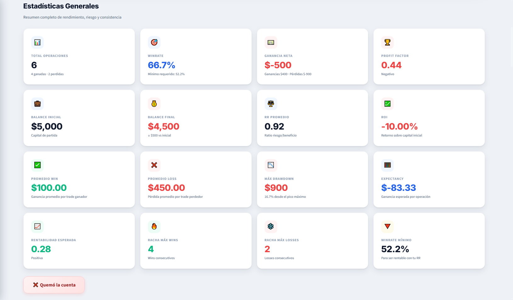
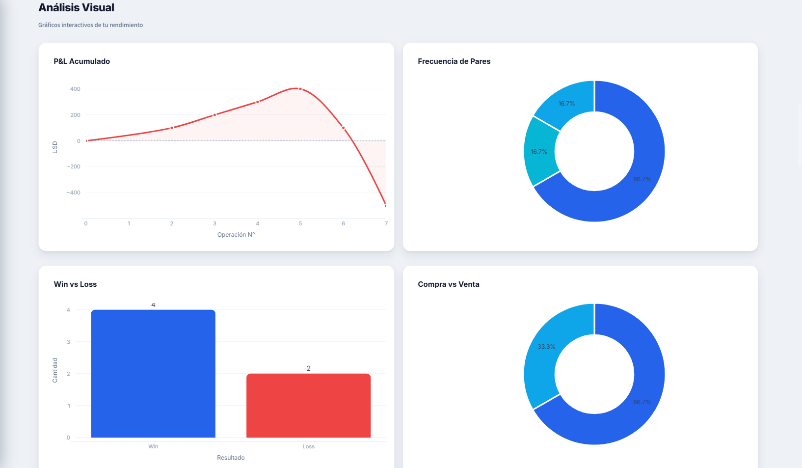
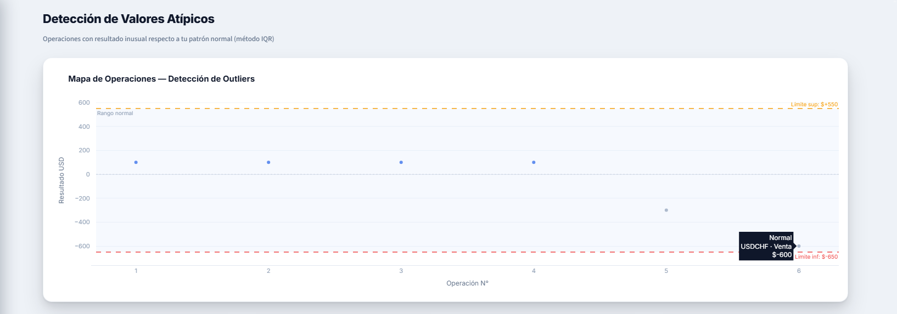

# Trading Dashboard Pro

**Dashboard de análisis de rendimiento para traders de Forex, Commodities e Índices.**

Construido en Python con Streamlit y Plotly. Gratis, open source y listo para usar.


---

## Preview

| KPIs & Métricas | Gráficos Interactivos | Detección de Outliers |
|:---:|:---:|:---:|
|  |  |  |

---

## Características

### 16 KPIs en Tiempo Real
- **Rendimiento**: Winrate, Ganancia Neta, ROI, Balance Acumulado
- **Riesgo**: Profit Factor, Max Drawdown, RR Promedio, Winrate Mínimo
- **Consistencia**: Expectancy, Rachas Win/Loss, Rentabilidad Esperada

### Gráficos Interactivos
- Curva P&L acumulado desde cero (tendencia real)
- Winrate por par con barras comparativas
- Distribución SL vs TP (boxplot)
- Frecuencia de pares y tipo de operación (donut charts)
- Rendimiento diario, semanal y mensual

### Detección de Valores Atípicos
- Método IQR ×1.5 para identificar operaciones anormales
- Separa tu "edge real" de golpes de suerte o pérdidas extremas
- Muestra el P&L sin atípicos para evaluación objetiva

### Modelo Predictivo
- Regresión lineal sobre rentabilidad acumulada
- Pendiente de predicción (USD/día)
- Interpretación automática de tendencia

### Funcionalidades Adicionales
- +70 instrumentos: Majors, Crosses, XAUUSD, XAGUSD, USOIL, Índices, Crypto CFDs, Exóticos
- Registro de operaciones con formulario sidebar
- Carga de CSV externo
- Exportación a CSV y Excel con resumen ejecutivo
- Calendario económico (noticias de alto impacto)
- Reset de datos con confirmación

---

## Instalación

### Requisitos
- Python 3.8 o superior
- pip

### Pasos

```bash
# 1. Clonar el repositorio
git clone https://github.com/TU_USUARIO/trading-dashboard-pro.git
cd trading-dashboard-pro

# 2. Instalar dependencias
pip install -r requirements.txt

# 3. Ejecutar el dashboard
streamlit run App.py
```

El dashboard se abrirá automáticamente en `http://localhost:8501`

---

## Dependencias

| Librería | Uso |
|----------|-----|
| `streamlit` | Framework web para el dashboard |
| `plotly` | Gráficos interactivos |
| `pandas` | Manipulación de datos |
| `numpy` | Cálculos numéricos |
| `scikit-learn` | Modelo de regresión lineal |
| `openpyxl` | Exportación a Excel |
| `requests` | Noticias económicas |
| `beautifulsoup4` | Parsing de calendario económico |

---

## Cómo Usar

### Registrar Operaciones
1. Abre el sidebar (barra lateral izquierda)
2. Ingresa tu **Balance TOTAL** de cuenta
3. Selecciona el **Par/Instrumento** del dropdown
4. Completa: Tipo, Resultado USD, SL y TP en pips
5. Click en **"Agregar operación"**

### Cargar Datos Existentes
Sube un archivo CSV con las columnas:
```
Fecha, Par, Tipo, SL (pips), TP (pips), Resultado USD
```

### Exportar Resultados
- **CSV**: Descarga con todos los datos y métricas calculadas
- **Excel**: Reporte con hoja de resumen KPI + hoja de operaciones formateada

---

## 📂 Estructura del Proyecto

```
trading-dashboard-pro/
├── App.py                       # Código principal del dashboard
├── requirements.txt             # Dependencias Python
├── README.md                    # Este archivo
├── LICENSE                      # Licencia MIT
├── .gitignore                   # Archivos ignorados
├── operaciones_trading.csv      # Datos (se genera automáticamente)
└── screenshots/                 # Capturas de pantalla
    ├── kpis.png
    ├── charts.png
    └── outliers.png
```

---

## Contribuir

Las contribuciones son bienvenidas. Si quieres mejorar el proyecto:

1. Fork el repositorio
2. Crea tu branch (`git checkout -b feature/nueva-feature`)
3. Commit tus cambios (`git commit -m 'Agrega nueva feature'`)
4. Push al branch (`git push origin feature/nueva-feature`)
5. Abre un Pull Request

### Ideas para contribuir
- Integración con APIs de brokers (MetaTrader, cTrader)
- Más modelos predictivos (ARIMA, Prophet)
- Dark/Light mode toggle
- Multi-idioma
- Backtesting engine

---

## Licencia

Este proyecto está bajo la licencia MIT — puedes usarlo, modificarlo y distribuirlo libremente.

---

## Autor

**Angel Hoyos**
- LinkedIn: [Angel Hoyos](https://www.linkedin.com/in/angel-hoyos-8647ab319/)
- Medellín, Colombia

---

## Si te sirvió, dale una estrella al repo

Es gratis y me ayuda a seguir creando herramientas para la comunidad trader.
